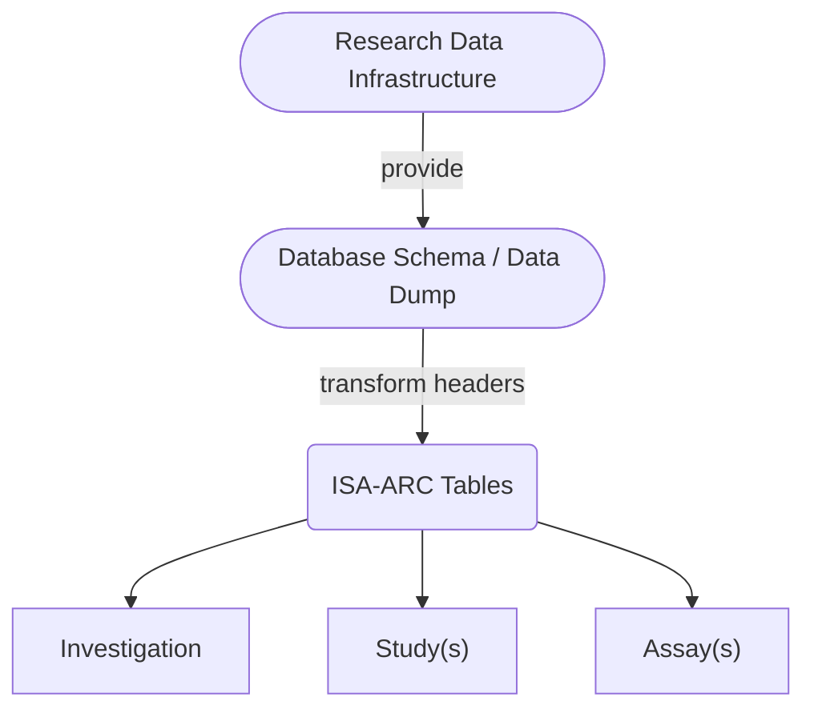
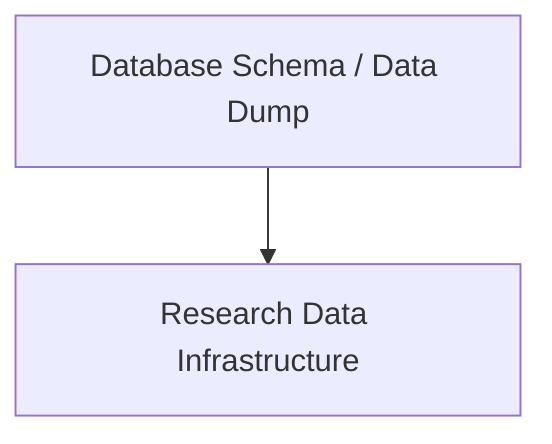

---
title: 'BioHackEU24 report: Creating user benefit from ARC-ISA RO-Crate machine-actionability & Increasing FAIRness of digital agrosystem resources by extending Bioschemas'
title_short: 'BioHackEU24 #19: arc-isa-ro-crate-machine-actionability | #24: increasing-fairness-of-digital-agrosystem'
tags:
  - ARC
  - RO-Crate
  - ISA
  - Dataverse
  - FAIRDOM-Seek
  - FAIR
  - RDM
  - Bioschemas
authors:
  - name: Daniel Arend
    orcid: 0000-0002-2455-5938
    affiliation: 1
  - name: Daniel Bauer
    orcid: 0000-0001-9447-460X
    affiliation: 2
  - name: Sebastian Beier
    orcid: 0000-0002-2177-8781
    affiliation: 3
  - name: Marco Brandizi
    orcid: 0000-0002-5427-2496
    affiliation: 4
  - name: Dominik Brilhaus
    orcid: 0000-0001-9021-3197
    affiliation: 5
  - name: Eli Chadwick
    orcid: 0000-0002-0035-6475
    affiliation: 6
  - name: Vera Clemens
    orcid: 0000-0002-9917-4443
    affiliation: 7
  - name: Michael R. Crusoe
    orcid: 0000-0002-2961-9670
    affiliation: 8
  - name: Manuel Feser
    orcid: 0000-0001-6546-1818
    affiliation: 1
  - name: Jonas Grieb
    orcid: 0000-0002-8876-1722
    affiliation: 2
  - name: Xiaoming Hu
    orcid: 0000-0002-8318-3222
    affiliation: 9
  - name: Abigail Miller
    orcid: 0000-0001-9228-2882
    affiliation: 10
  - name: Timo Mühlhaus
    orcid: 0000-0003-3925-6778
    affiliation: 11
  - name: Stuart Owen
    orcid: 0000-0003-2130-0865
    affiliation: 6
  - name: Maja Rey
    orcid: 0000-0003-4724-3926
    affiliation: 9
  - name: Gabriel Schneider
    orcid: 0000-0001-6573-3115
    affiliation: 7
  - name: Julian Schneider
    orcid: 0000-0002-3322-8672
    affiliation: 7
  - name: Kevin Schneider
    orcid: 0000-0002-2198-5262
    affiliation: 11
  - name: Heinrich Lukas Weil
    orcid: 0000-0003-1945-6342
    affiliation: 11
  - name: Florian Wetzels
    orcid: 0000-0002-5526-7138
    affiliation: 11
   
affiliations:
  - name: Leibniz Institute for Plant Genetics and Crop Plant Research (IPK) Gatersleben, Germany
    index: 1
  - name: Senckenberg - Leibniz Institution for Biodiversity and Earth System Research, Frankfurt am Main, Germany
    index: 2  
  - name: Institute of Bio- and Geosciences (IBG-4 Bioinformatics), Bioeconomy Science Center (BioSC), CEPLAS, Forschungszentrum Jülich GmbH, 52425 Jülich, Germany
    index: 3
  - name: Intelligent Data Ecosystems, Rothamsted Research, Harpenden, UK
    index: 4
  - name: Cluster of Excellence on Plant Sciences (CEPLAS) / Heinrich-Heine-University Düsseldorf, Germany
    index: 5
  - name: Department of Computer Science, The University of Manchester, United Kingdom
    index: 6
  - name: Knowledge Management Department, ZB MED – Information Centre for Life Sciences, 50931 Cologne, Germany
    index: 7
  - name: Mathematics of Complex Systems division, Visual and Data-Centric Computing department, Bioinformatics in Medicine group, Zuse Institute Berlin (ZIB), Berlin, Germany
    index: 8
  - name: Scientific Databases and Visualization, Heidelberg Institute for Theoretical Studies, 69118 Heidelberg, Germany
    index: 9
  - name:  The Jackson Laboratory, Bar Harbor, ME, USA
    index: 10
  - name: Computational Systems Biology, Rheinland-Pfälzische Technische Universität Kaiserslautern-Landau, Germany
    index: 11

date: 06 November 2024
cito-bibliography: paper.bib
event: BH24EU
biohackathon_name: "BioHackathon Europe 2024"
biohackathon_url:   "https://biohackathon-europe.org/"
biohackathon_location: "Barcelona, Spain, 2024"
group: Project 19 & Project 24 
# URL to project git repo --- should contain the actual paper.md:
git_url: https://github.com/sebeier/sebeier-bhe24-19_arc-isa-ro-crate-machine-actionability
# This is the short authors description that is used at the
# bottom of the generated paper (typically the first two authors):
authors_short: Arend, Bauer \emph{et al.}
---


# Introduction

As part of the BioHackathon Europe 2024, we here report on the progress that both project 19 and project 24 have made during the event. For the purpose of this report we will present the abstract of both projects and then dive deeper on what work was done during the BioHackathon.

## Project 19: Creating user benefit from ARC-ISA RO-Crate machine-actionability
The development of FAIR Digital Objects (FDOs) holds immense promise for advancing scientific research, yet one critical challenge persists: Despite efforts to create FDOs, achieving true machine-actionability remains elusive.

We will address this pressing issue by focusing on the integration of Annotated Research Contexts (ARCs) within the scientific community. Recognizing the substantial efforts in annotating research and packaging it as RO-Crate FDOs, it is imperative to incentivize and leverage these endeavors to yield benefits transcending mere data management. ARCs as FDOs excel in meticulous record-keeping, rendering them indispensable in the realm of research data management.

However, dissemination and practical actionability of ARCs across diverse services, tools and repositories is pivotal in engendering user benefits. These platforms require the capacity to comprehend and interpret RO-Crates, enabling seamless interaction with FDOs. Drawing from ARC FDO consumption, search, and indexing platforms must provide users with comprehensive search results, while the service infrastructure can offer customised services tailored to the data described in the FDO.

Therefore, we will build a robust content-based recommendation framework. This approach promises to furnish users with enriched representations of ARC RO-Crate content, facilitating content-based filtering tailored to individual user needs.

To substantiate the efficacy of this framework, Galaxy will serve as the representative workflow engine in a proof-of-concept endeavor aimed at suggesting workflows based on data annotated and encapsulated within ARC RO-Crates. Leveraging collaborative efforts uniting domain experts, developers, and stakeholders across diverse backgrounds, our objective is to engineer practical solutions that render ARC-ISA RO-Crates actionable across pivotal platforms.

## Project 24: Increasing FAIRness of digital agrosystem resources by extending Bioschemas

Research Data Infrastructures (RDIs) provide crucial publication services for researchers in the agrosystem domain. Due to their heterogeneous user communities and requirements, metadata standardization approaches to increase the FAIRness of resources can be a catalyst in simplifying data reusability and enabling cross-domain research.

One way for RDIs to increase the Findability of their resources is to provide metadata markup via Schema.org, a vocabulary consumed by well-known search engines. Bioschemas, an extension of schema.org focussed on the life sciences, is an open community effort, aiming at increasing the adoption of key metadata properties in a domain-targeted manner, through the creation of needed domain-associated types, agreed properties and usable metadata profiles for describing those life science resources. The project will work on developing new resources (types, properties, profiles) for Bioschemas, which will help to describe agrosystem datasets in a FAIR manner.

Participants will work on different topics, ranging from evaluating the current state of developed types and properties relevant to agrosystem resources to drafting new ones following use-case requirements and using example datasets. For increasing the metadata quality and supporting RDIs and their users in adopting the extension, participants will link properties to domain ontologies and facilitate mappings to other metadata standards, bolstering interoperability while following mapping frameworks like FAIR-IMPACT’s approach. To further ease the adoption for RDIs, participants will work on creating guidance and best practice documents on how to implement the extension into existing metadata description processes.

# Metadata findability and harmonisation

The retrievability and harmonisation of metadata is important for improving the FAIRness of data, especially across different research areas. Projects 19 and 24 addressed different but complementary aspects of this challenge.

## "AGRISchema / schema.org extension"
To increase the findability of datasets from the agrosystem domain core entities of research projects, such as crops, soils etc. need to be described in the respective metadata instances. A schema focussed on findability is Schema.org and Bioschemas as a domain specific extension for the life sciences. In the context of project 24, core entities were identified based on the requirements of use cases of the FAIRagro project (part of the German National Research Data Infrastructure NFDI) for searching datasets, and explored multiple ways on how to create Bioschemas metadata descriptions to identify where the schema needs to be extended for the agrosystem domain.

The initial idea aimed at designing new types, planned to be submitted as drafts to the Bioschemas community. To this end, we worked on example datasets that had been selected in advance to broadly represent different agronomically important use cases (https://data.fz-juelich.de/dataset.xhtml?persistentId=doi:10.26165/JUELICH-DATA/QJIY7C). The datasets contained information on crops describing their taxonomic species ranks as well as their specific variety names.

A new potential 'Crop' type for Bioschemas was discussed, which could be defined as a subtype of the already existing [BioChemEntity](https://bioschemas.org/BioChemEntity) type. The 'BioChemEntity' type already includes the "taxonomicRange" property, which can represent a crop species by linking to established semantic resources, such as the NCBI Taxonomy. To addresss the need for more granular information, such as details on specific crop varieties that are critical for satisfying more detailed search queries, a new property 'variety' could be introduced. This property could accept values either as a string or as a link to a semantic resource detailing the variety, if such resources are available.

An alternative approach emerged after discussions with project 19. Instead of drafting the new type 'Crop' we explored the possibility of using existing 'BioSample' objects linked to other objects via 'LabProcess'. Each BioSample object could carry domain-relevant properties attached as additionalProperty entries, with propertyIDs linking to appropriate ontologies or terminologies.

An example 
```
add json markup
```

As part of the efforts to harmonise metadata for the agrosystem domain, the integration of data from the EBI Gene Expression Atlas (GXA) was carried out as a practical use case. The aim of this work was to test and refine the proposed approaches to metadata modelling developed under the FAIRAgro and AgriSchemas initiatives, with a focus on datasets related to agriculturally important plants such as *Triticum aestivum* (wheat) and *Arabidopsis thaliana*.

To facilitate this integration, a migration was carried out from the now-obsolete ArrayExpress API previously used by GXA to the newer BioStudies API. This transition ensured that datasets could be accessed via a more robust and up-to-date interface. After the data had been extracted, the metadata format was updated to align it with the latest modelling decisions. This process involved adapting the datasets to RDF-based representations while maintaining compatibility with ontologies such as MIAPPE and AgriSchemas.

The modelling approach adopted for this use case represented experiments as ```Bioschema:Studyobjects```. Plant species were annotated with the ```Schema:BioChemEntitytype```, which was additionally enriched with links to relevant ontologies, including MIAPPE (```ppeo:material_source```) and AgriSchemas (```agri:FieldTrialBioMaterialSource```). Publications associated with the experiments posed a challenge, as they could not always be classified as articles. To address this, the ```agri:ScholarlyPublication``` type was used in place of ```bioschemas:Article```, accommodating other types of publications, such as book chapters or reports.

A newly proposed property, ```agri:authorList```, was introduced to capture the author list as a single string. This approach was necessary because Schema.org and Bioschemas do not currently offer a direct mechanism for representing this information. Including this property is particularly valuable for enabling tasks such as text mining to extract author details or identifying associated ORCIDs.

Gene expression data presented a particular challenge due to the complexity of relationships within the datasets. To overcome this, properties such as ```agri:baseCondition```, ```agri:log2FoldChange``` and ```agri:evidence``` were introduced to provide detailed descriptions of experimental parameters and results linked with the ```bioschema:expressedIn``` connection. These properties were attached to the dataset components using semantic links using ```rdf:Statement``` vocabulary to ensure a FAIR-compliant representation that facilitates data reuse and integration. While an alternative approach using ```schema:Role``` was considered, it was ultimately deemed unsuitable due to its limited adoption and unclear applicability for this context.

This use case highlights the potential of harmonised metadata frameworks for improving the findability and interoperability of agricultural data sets. However, it also revealed challenges, such as ensuring scalability for larger datasets and adapting the models to dataset-specific requirements. While the current implementation has been successfully tested on individual experiments, further automation is needed to optimise the integration process for large data sets.

## Harmonising data across ecosystems using the ARC concept

In addition to increasing the findability of research data within the agrosystem domain, another reason for defining new schema.org types was the goal of harmonising datasets from different areas in order to integrate them both within and with ARC-based ecosystems, thus enabling the data to be used by different services in frame of the FAIRagro consortium. Nevertheless, it was found that while this approach is suitable for a broad field of research data infrastructures, it also restricts the actual research data provider to adhere to these predefined types and fixed attributes, which can be particularly problematic for datasets containing very large and diverse metadata schema. Furthermore, all research data infrastructures would have to modify their implementation to provide an updated metadata markup using these newly defined types. Therefore alongside the discussion and design of agrosystems related types for Schema.org / Bioschemas, we also considered an alternative approach for harmonising heterogeonous datasets using the ARC data model. The main reason for this is the limitations associated with defining fixed types to describe data entities. The modularity of the ISA framework in defining fixed parameters and variable factors allows for a more flexible way of modelling different research metadata and the data representation of the agrosystem domain.

The basic idea of integrating ARCs does not require any changes to the existing implementations of metadata schemas of infrastructure providers. Instead of applying harmonised metadata types at the infrastructure level, ARCs can be created from any data structure. These data structures serve as building blocks for the ARC, with their components corresponding to the ISA headers in ISA files. The actual data integration takes place at the level of the integrated ARC ontology, where domain and ontology experts define the concepts and identifiers used.

This ontology-driven approach allows the resulting ARCs to be harmonised by applying cross-references that establish links between heterogeneous attributes within ARC fields. By putting the harmonisation process in the hands of domain experts, this method avoids placing additional demands on research data infrastructure providers, while still enabling a consistent and interoperable framework for data integration across different domains.





In lights of discussion between Project 19 and 24, it became clear that working together on these metadata definitions and harmonisations would benefit both teams. Most of the subsequent work focused on adopting and refining the ARC concept. ARC provides a framework for representing metadata in ISA-JSON format and facilitates its transformation into RO-Crate, a metadata (and data) packaging standard that uses Schema.org and Bioschemas metadata annotations. The collaboration between the projects aimed at improving interoperability and optimisation the presentation and reuse of metadata.

# Improving FAIRness in Data Management Platforms

Effective data management platforms play a critical role in the sharing, integration, and reuse of research data, particularly in fields such as agrosystems that rely on diverse and complex data sets. Dataverse and FAIRDOM-Seek are two such platforms that support these goals and each provide unique features for managing and sharing data in adherence with the FAIR principles.

Dataverse is a general-purpose repository designed for sharing and publishing datasets across various research disciplines. Its metadata model is straightforward and emphasises dataset-level information that supports discoverability and citability. FAIRDOM-Seek, on the other hand, is tailored to manage complex research workflows, particularly in the life sciences. By using the ISA framework, it enables detailed descriptions of experiments and links data, samples, and protocols in a way that Dataverse does not.

During the BioHackathon, we worked to improve the handling of agricultural system data on both platforms, focusing on improving their FAIR compliance and alignment with ARC-based ecosystems. For Dataverse, this meant adapting its metadata capabilities to better support the specific requirements of agrosystems and ensure interoperability with the ARC standard. For FAIRDOM-Seek, we focused on refining its ability to integrate ARC-compliant metadata while maintaining its flexibility to capture detailed workflows.

## Adding ARC compliance in Dataverse

The goal of the work done within Dataverse was to enable users to upload their datasets as ARC containers and make the associated metadata retrievable and searchable within the platform. The focus was on improving the ability to represent metadata in a standardised format, allowing it to be easily integrated into ARC-compliant ecosystems.

As part of this task, a custom metadata block was developed in Dataverse to support ARC RO-Crates. The chosen metadata model was well-suited for backend processing, ensuring that the metadata was appropriately structured for ARC containers. However, challenges were encountered with the user interface, which currently does not fully support the visualisation of these customisations. These UI issues can be addressed in future iterations with assistance from the Dataverse community.

To test the system, an ARC RO-Crate was used to evaluate how the metadata appeared and how well search functionality worked for fields that were not visible in the UI. The test showed that while the search function worked for hidden fields, the solution was limited to a custom Dataverse instance. Further development will be required to extend this functionality to all Dataverse instances and ensure its scalability across different setups.


## Integrating ARCs with FAIRDOM-Seek

In Project 19, significant progress was made towards integrating ARC-compliant metadata with FAIRDOM-Seek, enhancing the platform's ability to support ARC containers. The project team developed a detailed plan and outlined tasks to facilitate the integration, with a focus on improving the import capabilities of ARC RO-Crates. The team leveraged the RO-Crate Ruby library to ensure seamless handling of ARC containers within the SEEK ecosystem.

Initially, the integration work concentrated on modelling Investigation metadata, enabling the transfer of relevant data between FAIRDOM-Seek and ARC containers. However, further work is needed to extend the integration of more Study and Assay metadata, which are also critical components of the ARC metadata model. 


# Machine-actionability and Workflow Integration with Galaxy

Project 19 focused on improving the machine-actionability of ARC containers packaged as RO-Crates. For simplification and practical reasons, we chose an RNA-Seq analysis with DESeq2 as a use case for the BioHackathon. The goal was to invoke a workflow on Galaxy that relies on metadata from an ARC and allows users to run analysis directly from a preconfigured setup. We successfully wrapped DESeq2 in CWL, although there were some initial challenges with the Docker integration.

During discussions with Björn Grüning, it became clear that other Galaxy communities had already done preliminary work on running workflows that were similar in scope to what we had in mind. He showed a work in progress use case that demonstrated how data from an external source could be used to automatically populate and start a Galaxy workflow without the need for manual configuration. This process, called a ‘landing page’, allows workflows to be automatically pre-populated based on available metadata, although some customisation would be required for any specific tool or workflow. In practice, a user could trigger such a landing page directly from the ARC DataHub by clicking a button such as ‘Run DESeq2 workflow’, which further simplifies the workflow initiation process.

A key challenge arose from Galaxy's requirement to retain control over operations on its servers. As such, fully automatic execution of workflows was not possible. Instead, workflows must be manually acknowledged by the user before execution, with a link to a user account (e.g. via Life-Science-Login). Looking ahead, we plan to improve the reusability of the DESeq2 CWL workflow by making it re-executable via Workflow Run Crates [[WRROC](https://www.researchobject.org/workflow-run-crate/)] and to enhance the integration between ARC and Galaxy for more seamless and reproducible data analysis workflows.


# Modelling and validation

## Validation

In August 2024 a new Python package for RO-Crate validation was released into public beta: [roc-validator](https://pypi.org/project/roc-validator/), also called [rocrate-validator](https://github.com/crs4/rocrate-validator) on GitHub. This package combines validation of a crate's JSON-LD metadata with validation of the crate's file structure. 

The JSON-LD validation uses SHACL, an RDF validation language which uses RDF syntax itself. The `roc-validator` package has modular support for RO-Crate profiles, meaning anyone can add their own profile to the package. As well as the base specification, a few profiles are already supported: Workflow RO-Crate, Workflow Run Crate (Eli: check this). 
At runtime, a Python wrapper collects and applies the SHACL files required to validate a particular crate against the profile(s) it conforms to. One example of a check that would use SHACL is "ensure that the crate's root data entity specifies a `license`."

The file structure validation is written in Python, and is generally more straightforward to write. An example check would be "ensure that data entities whose `@id` is a local path are present in the crate directory."

## Validating ARC RO-Crates

Validating ARC RO-Crates poses a novel challenge, as an ARC is a large research object consisting of many subdirectories, some of which may resemble specific RO-Crate profiles.

For example, an ARC may include a `workflows/` directory which contains one or more workflow subdirectories, where each workflow is structured like a Workflow RO-Crate. That same ARC may also include a `runs/` directory which contains one or more workflow *executions*, where each execution is structured like a Workflow Run Crate and references a workflow from the `workflows/` directory.

Crucially, these subdirectories are not themselves RO-Crates, because they do not have their own metadata files. This means that even though they follow a similar structure (and the relevant metadata may be included in the metadata file at the top level of the crate), they cannot be directly validated using the Workflow RO-Crate/Workflow Run Crate profiles that already exist in the `roc-validator` package.

As we got underway at the BioHackathon, we felt that it was important to try and resolve this issue before beginning to write a validation profile for ARCs, as it would be strongly preferable to reuse the existing validation profiles rather than writing a custom one for a workflow nested within an ARC (and risk falling out of sync with bug fixes or other updates to the original profiles). Therefore, during the hackathon we explored two ideas:

1. Could we make these subdirectories into fully fledged RO-Crates by giving them their own metadata files? That way we would be able to feed these sub RO-Crates into `roc-validator` recursively while validating the ARC as a whole.
2.  Could we find a way to "filter" or "scope" an RO-Crate's metadata such that one could pick out the metadata for a subdirectory in a way that complies with a particular RO-Crate profile? This would provide a mechanism to declare, for example, "if you filter this crate's metadata in *this* way, you will see metadata that conforms to the Workflow RO-Crate profile."

 Our investigations and conclusions for each of these ideas are summarised below.

**1. Crates within Crates, a.k.a. "Nested RO-Crates"**

At first glance this is an intuitive approach. The RO-Crate specification already supports including one RO-Crate inside another, and a new section has recently been added to version 1.2 (releasing Soon(TM), Eli: check status before publishing this report) with additional details on [how to reference other RO-Crates](https://www.researchobject.org/ro-crate/specification/1.2-DRAFT/data-entities.html#referencing-other-ro-crates) from within a RO-Crate in different situations (local subdirectory, remote reference, etc).

This approach may be appropriate and useful in cases where **the child RO-Crates are fully independent of each other**.

However, in the ARC context, an ARC may contain (for example) both a Workflow RO-Crate and a Workflow Run Crate, where the latter needs to reference the former. If both child crates are local subdirectories of the parent crate, this cross-reference can only be achieved using local paths that navigate up and back down the folder hierarchy (e.g. a workflow execution in "runs/run1/" referencing a workflow in "../../workflows/my_workflow/"). Needing to "leave" the crate to access referenced files breaks the independence that is usually expected of an RO-Crate - if the child RO-Crate is removed from its parent, the cross-reference will no longer work.

We attempted to solve this problem by drafting a "Nested RO-Crate" profile - i.e. a profile for an RO-Crate that exists inside another RO-Crate.

This profile would require that a conforming crate must not be distributed on its own without first ensuring that its parent crate could still be recovered (e.g. retrievable from a URI). 
A conforming crate would also need to contain a description of any other crates from which it references files - which can mean describing relevant parts of a folder hierarchy. This means that anyone reading the crate can get an understanding of the structure of its parent even if it is not present.

Ultimately, we decided that this was not a practical approach for the needs of ARC RO-Crates. This became particularly clear when we tried to construct an example, as it rapidly became very convoluted. Our draft profile and corresponding example remain visible in this repository: https://github.com/dnlbauer/bh24-ro-crate-extension (Eli: move the profile spec below to this repo)

**Idea: Nested RO-Crate profile**

```
An Ro-Crate that exists inside another RO-Crate
MUST NOT be distributed alone 
	UNLESS parent crate is retrievable from a URI (ie you can download it, including both the data and the metadata)
	OR all relative paths within the crate which start with ../ are replaced
```

The parent crate already refers to the child crate using hasPart ([from](https://www.researchobject.org/ro-crate/specification/1.2-DRAFT/data-entities.html#referencing-files-and-folders-from-the-root-data-entity), where files and folders are represented as Data Entities in the RO-Crate JSON-LD, these MUST be linked to, either directly or indirectly, from the Root Data Entity using the hasPart property. )

The child crate
The child crate MUST include the Nested RO-Crate Profile in its conformsTo property of the root data entity or the metadata entity (TBD).

If a sub-directory is an RO-Crate but is expected to be distributed as part of the parent crate (rather than being standalone), it MUST have isPartOf on the root data entity pointing to a contextual entity representing the parent crate. The @id of that entity may be:
A relative path e.g. “../”
An absolute URI

If the child crate references a file in another RO-Crate (e.g. a sibling crate), the other RO-Crate MUST be included as a contextual entity, and the hasPart property SHOULD be used to indicate the “family tree” of the referenced crates (e.g. if we reference a sibling crate, the sibling crate SHOULD appear in the hasPart of the shared parent crate).
Within the child crate’s metadata, the parent crate does not need to include the current crate in hasPart (because this relationship is already established through isPartOf on the root data entity of the child crate) but if there are multiple other entities in hasPart then it is clearer to include it.

Must be possible to verify if the crate is currently stored inside another crate - tools should check this?

**2. Filtering or scoping metadata within a crate, a.k.a. "RO-Crate Entry Points"**

(Eli: write this :) )

**Alternative idea: Scoping metadata within a big RO-Crate**

Say “this subfolder would be a Workflow RO-Crate if it had such and such additional metadata”

and/or

Use separate entities as “entry points” to viewing the crate through the lens of different profiles through use of conformsTo
Like using a different root dataset for validating the workflow ro-crate profile vs the workflow run ro-crate vs the assay etc
Somehow tag entities so that you can “filter” for say “everything that is relevant for treating this crate as a workflow ro-crate”
Would require profiles to be reframed so that profile requirements applying to the “root dataset” or the “root folder” now apply to the “entry point dataset” or the relevant subfolder (for backward compatibility: the root dataset is the default entry point)

https://www.researchobject.org/ro-crate/specification/1.2-DRAFT/data-entities.html#directory-file-entity
> RO-Crates themselves can be specialized using Profile Crates, specified with conformsTo on the root data entity.


Add “Directory data entities (Dataset) can also be specialized using conformsTo pointing to a Profile Crate (an entity of type Profile)“


> Profiles of referenced crates
> If the referenced crate conforms to a given RO-Crate profile, this MAY be indicated by expanding conformsTo on the Dataset to an array to reference the profile as an contextual entity:
Also, if a directory within a crate conforms to a given RO-Crate profile, this MAY be indicated by expanding conformsTo on the Dataset to an array to reference the profile as an contextual entity:
Entry points for sub-crates SHOULD be included in about on the ro-crate-metadata.json (or through the root data entity, TBD). Entry points SHOULD/MUST have @type EntryPoint (not a real type) and MUST have conformsTo pointing to a Profile Crate


Expectations for profiles are set out in https://www.researchobject.org/ro-crate/specification/1.2-DRAFT/profiles.html#publishing-an-ro-crate-profile 
Add: When considering requirements on the root data entity, also consider entry points
Profiles SHOULD define the required metadata for an entry point, which can be treated like the root data entity in the context of this profile. 


## LinkML

* Fleshed out nested crate ideas - see above

# Summary

This document use Markdown and you can look at [this tutorial](https://www.markdowntutorial.com/).

## Acknowledgements

...

## References
---
title: 'BioHackEU24 report: Creating user benefit from ARC-ISA RO-Crate machine-actionability & Increasing FAIRness of digital agrosystem resources by extending Bioschemas'
title_short: 'BioHackEU24 #19: arc-isa-ro-crate-machine-actionability | #24: increasing-fairness-of-digital-agrosystem'
tags:
  - ARC
  - RO-Crate
  - ISA
  - Dataverse
  - FAIRDOM-Seek
  - FAIR
  - RDM
  - Bioschemas
authors:
  - name: Daniel Arend
    orcid: 0000-0002-2455-5938
    affiliation: 1
  - name: Daniel Bauer
    orcid: 0000-0001-9447-460X
    affiliation: 2
  - name: Sebastian Beier
    orcid: 0000-0002-2177-8781
    affiliation: 3
  - name: Marco Brandizi
    orcid: 0000-0002-5427-2496
    affiliation: 4
  - name: Dominik Brilhaus
    orcid: 0000-0001-9021-3197
    affiliation: 5
  - name: Eli Chadwick
    orcid: 0000-0002-0035-6475
    affiliation: 6
  - name: Vera Clemens
    orcid: 0000-0002-9917-4443
    affiliation: 7
  - name: Michael R. Crusoe
    orcid: 0000-0002-2961-9670
    affiliation: 8
  - name: Manuel Feser
    orcid: 0000-0001-6546-1818
    affiliation: 1
  - name: Jonas Grieb
    orcid: 0000-0002-8876-1722
    affiliation: 2
  - name: Xiaoming Hu
    orcid: 0000-0002-8318-3222
    affiliation: 9
  - name: Abigail Miller
    orcid: 0000-0001-9228-2882
    affiliation: 10
  - name: Timo Mühlhaus
    orcid: 0000-0003-3925-6778
    affiliation: 11
  - name: Stuart Owen
    orcid: 0000-0003-2130-0865
    affiliation: 6
  - name: Maja Rey
    orcid: 0000-0003-4724-3926
    affiliation: 9
  - name: Gabriel Schneider
    orcid: 0000-0001-6573-3115
    affiliation: 7
  - name: Julian Schneider
    orcid: 0000-0002-3322-8672
    affiliation: 7
  - name: Kevin Schneider
    orcid: 0000-0002-2198-5262
    affiliation: 11
  - name: Heinrich Lukas Weil
    orcid: 0000-0003-1945-6342
    affiliation: 11
  - name: Florian Wetzels
    orcid: 0000-0002-5526-7138
    affiliation: 11
   
affiliations:
  - name: Leibniz Institute for Plant Genetics and Crop Plant Research (IPK) Gatersleben, Germany
    index: 1
  - name: Senckenberg - Leibniz Institution for Biodiversity and Earth System Research, Frankfurt am Main, Germany
    index: 2  
  - name: Institute of Bio- and Geosciences (IBG-4 Bioinformatics), Bioeconomy Science Center (BioSC), CEPLAS, Forschungszentrum Jülich GmbH, 52425 Jülich, Germany
    index: 3
  - name: Intelligent Data Ecosystems, Rothamsted Research, Harpenden, UK
    index: 4
  - name: Cluster of Excellence on Plant Sciences (CEPLAS) / Heinrich-Heine-University Düsseldorf, Germany
    index: 5
  - name: Department of Computer Science, The University of Manchester, United Kingdom
    index: 6
  - name: Knowledge Management Department, ZB MED – Information Centre for Life Sciences, 50931 Cologne, Germany
    index: 7
  - name: Mathematics of Complex Systems division, Visual and Data-Centric Computing department, Bioinformatics in Medicine group, Zuse Institute Berlin (ZIB), Berlin, Germany
    index: 8
  - name: Scientific Databases and Visualization, Heidelberg Institute for Theoretical Studies, 69118 Heidelberg, Germany
    index: 9
  - name:  The Jackson Laboratory, Bar Harbor, ME, USA
    index: 10
  - name: Computational Systems Biology, Rheinland-Pfälzische Technische Universität Kaiserslautern-Landau, Germany
    index: 11

date: 06 November 2024
cito-bibliography: paper.bib
event: BH24EU
biohackathon_name: "BioHackathon Europe 2024"
biohackathon_url:   "https://biohackathon-europe.org/"
biohackathon_location: "Barcelona, Spain, 2024"
group: Project 19 & Project 24 
# URL to project git repo --- should contain the actual paper.md:
git_url: https://github.com/sebeier/sebeier-bhe24-19_arc-isa-ro-crate-machine-actionability
# This is the short authors description that is used at the
# bottom of the generated paper (typically the first two authors):
authors_short: Arend, Bauer \emph{et al.}
---


# Introduction

As part of the BioHackathon Europe 2024, we here report on the progress that both project 19 and project 24 have made during the event. For the purpose of this report we will present the abstract of both projects and then dive deeper on what work was done during the BioHackathon.

## Project 19: Creating user benefit from ARC-ISA RO-Crate machine-actionability
The development of FAIR Digital Objects (FDOs) holds immense promise for advancing scientific research, yet one critical challenge persists: Despite efforts to create FDOs, achieving true machine-actionability remains elusive.

We will address this pressing issue by focusing on the integration of Annotated Research Contexts (ARCs) within the scientific community. Recognizing the substantial efforts in annotating research and packaging it as RO-Crate FDOs, it is imperative to incentivize and leverage these endeavors to yield benefits transcending mere data management. ARCs as FDOs excel in meticulous record-keeping, rendering them indispensable in the realm of research data management.

However, dissemination and practical actionability of ARCs across diverse services, tools and repositories is pivotal in engendering user benefits. These platforms require the capacity to comprehend and interpret RO-Crates, enabling seamless interaction with FDOs. Drawing from ARC FDO consumption, search, and indexing platforms must provide users with comprehensive search results, while the service infrastructure can offer customised services tailored to the data described in the FDO.

Therefore, we will build a robust content-based recommendation framework. This approach promises to furnish users with enriched representations of ARC RO-Crate content, facilitating content-based filtering tailored to individual user needs.

To substantiate the efficacy of this framework, Galaxy will serve as the representative workflow engine in a proof-of-concept endeavor aimed at suggesting workflows based on data annotated and encapsulated within ARC RO-Crates. Leveraging collaborative efforts uniting domain experts, developers, and stakeholders across diverse backgrounds, our objective is to engineer practical solutions that render ARC-ISA RO-Crates actionable across pivotal platforms.

## Project 24: Increasing FAIRness of digital agrosystem resources by extending Bioschemas

Research Data Infrastructures (RDIs) provide crucial publication services for researchers in the agrosystem domain. Due to their heterogeneous user communities and requirements, metadata standardization approaches to increase the FAIRness of resources can be a catalyst in simplifying data reusability and enabling cross-domain research.

One way for RDIs to increase the Findability of their resources is to provide metadata markup via Schema.org, a vocabulary consumed by well-known search engines. Bioschemas, an extension of schema.org focussed on the life sciences, is an open community effort, aiming at increasing the adoption of key metadata properties in a domain-targeted manner, through the creation of needed domain-associated types, agreed properties and usable metadata profiles for describing those life science resources. The project will work on developing new resources (types, properties, profiles) for Bioschemas, which will help to describe agrosystem datasets in a FAIR manner.

Participants will work on different topics, ranging from evaluating the current state of developed types and properties relevant to agrosystem resources to drafting new ones following use-case requirements and using example datasets. For increasing the metadata quality and supporting RDIs and their users in adopting the extension, participants will link properties to domain ontologies and facilitate mappings to other metadata standards, bolstering interoperability while following mapping frameworks like FAIR-IMPACT’s approach. To further ease the adoption for RDIs, participants will work on creating guidance and best practice documents on how to implement the extension into existing metadata description processes.

# Metadata findability and harmonisation

The retrievability and harmonisation of metadata is important for improving the FAIRness of data, especially across different research areas. Projects 19 and 24 addressed different but complementary aspects of this challenge.

## "AGRISchema / schema.org extension"
To increase the findability of datasets from the agrosystem domain core entities of research projects, such as crops, soils etc. need to be described in the respective metadata instances. A schema focussed on findability is Schema.org and Bioschemas as a domain specific extension for the life sciences. In the context of project 24, core entities were identified based on the requirements of use cases of the FAIRagro project (part of the German National Research Data Infrastructure NFDI) for searching datasets, and explored multiple ways on how to create Bioschemas metadata descriptions to identify where the schema needs to be extended for the agrosystem domain.

The initial idea aimed at designing new types, planned to be submitted as drafts to the Bioschemas community. To this end, we worked on example datasets that had been selected in advance to broadly represent different agronomically important use cases (https://data.fz-juelich.de/dataset.xhtml?persistentId=doi:10.26165/JUELICH-DATA/QJIY7C). The datasets contained information on crops describing their taxonomic species ranks as well as their specific variety names.

A new potential 'Crop' type for Bioschemas was discussed, which could be defined as a subtype of the already existing [BioChemEntity](https://bioschemas.org/BioChemEntity) type. The 'BioChemEntity' type already includes the "taxonomicRange" property, which can represent a crop species by linking to established semantic resources, such as the NCBI Taxonomy. To addresss the need for more granular information, such as details on specific crop varieties that are critical for satisfying more detailed search queries, a new property 'variety' could be introduced. This property could accept values either as a string or as a link to a semantic resource detailing the variety, if such resources are available.

An alternative approach emerged after discussions with project 19. Instead of drafting the new type 'Crop' we explored the possibility of using existing 'BioSample' objects linked to other objects via 'LabProcess'. Each BioSample object could carry domain-relevant properties attached as additionalProperty entries, with propertyIDs linking to appropriate ontologies or terminologies.

An example 
```
add json markup
```

As part of the efforts to harmonise metadata for the agrosystem domain, the integration of data from the EBI Gene Expression Atlas (GXA) was carried out as a practical use case. The aim of this work was to test and refine the proposed approaches to metadata modelling developed under the FAIRAgro and AgriSchemas initiatives, with a focus on datasets related to agriculturally important plants such as *Triticum aestivum* (wheat) and *Arabidopsis thaliana*.

To facilitate this integration, a migration was carried out from the now-obsolete ArrayExpress API previously used by GXA to the newer BioStudies API. This transition ensured that datasets could be accessed via a more robust and up-to-date interface. After the data had been extracted, the metadata format was updated to align it with the latest modelling decisions. This process involved adapting the datasets to RDF-based representations while maintaining compatibility with ontologies such as MIAPPE and AgriSchemas.

The modelling approach adopted for this use case represented experiments as ```Bioschema:Studyobjects```. Plant species were annotated with the ```Schema:BioChemEntitytype```, which was additionally enriched with links to relevant ontologies, including MIAPPE (```ppeo:material_source```) and AgriSchemas (```agri:FieldTrialBioMaterialSource```). Publications associated with the experiments posed a challenge, as they could not always be classified as articles. To address this, the ```agri:ScholarlyPublication``` type was used in place of ```bioschemas:Article```, accommodating other types of publications, such as book chapters or reports.

A newly proposed property, ```agri:authorList```, was introduced to capture the author list as a single string. This approach was necessary because Schema.org and Bioschemas do not currently offer a direct mechanism for representing this information. Including this property is particularly valuable for enabling tasks such as text mining to extract author details or identifying associated ORCIDs.

Gene expression data presented a particular challenge due to the complexity of relationships within the datasets. To overcome this, properties such as ```agri:baseCondition```, ```agri:log2FoldChange``` and ```agri:evidence``` were introduced to provide detailed descriptions of experimental parameters and results linked with the ```bioschema:expressedIn``` connection. These properties were attached to the dataset components using semantic links using ```rdf:Statement``` vocabulary to ensure a FAIR-compliant representation that facilitates data reuse and integration. While an alternative approach using ```schema:Role``` was considered, it was ultimately deemed unsuitable due to its limited adoption and unclear applicability for this context.

This use case highlights the potential of harmonised metadata frameworks for improving the findability and interoperability of agricultural data sets. However, it also revealed challenges, such as ensuring scalability for larger datasets and adapting the models to dataset-specific requirements. While the current implementation has been successfully tested on individual experiments, further automation is needed to optimise the integration process for large data sets.

## Harmonising data across ecosystems using the ARC concept

In addition to increasing the findability of research data within the agrosystem domain, another reason for defining new schema.org types was the goal of harmonising datasets from different areas in order to integrate them both within and with ARC-based ecosystems, thus enabling the data to be used by different services in frame of the FAIRagro consortium. Nevertheless, it was found that while this approach is suitable for a broad field of research data infrastructures, it also restricts the actual research data provider to adhere to these predefined types and fixed attributes, which can be particularly problematic for datasets containing very large and diverse metadata schema. Furthermore, all research data infrastructures would have to modify their implementation to provide an updated metadata markup using these newly defined types. Therefore alongside the discussion and design of agrosystems related types for Schema.org / Bioschemas, we also considered an alternative approach for harmonising heterogeonous datasets using the ARC data model. The main reason for this is the limitations associated with defining fixed types to describe data entities. The modularity of the ISA framework in defining fixed parameters and variable factors allows for a more flexible way of modelling different research metadata and the data representation of the agrosystem domain.

The basic idea of integrating ARCs does not require any changes to the existing implementations of metadata schemas of infrastructure providers. Instead of applying harmonised metadata types at the infrastructure level, ARCs can be created from any data structure. These data structures serve as building blocks for the ARC, with their components corresponding to the ISA headers in ISA files. The actual data integration takes place at the level of the integrated ARC ontology, where domain and ontology experts define the concepts and identifiers used.

This ontology-driven approach allows the resulting ARCs to be harmonised by applying cross-references that establish links between heterogeneous attributes within ARC fields. By putting the harmonisation process in the hands of domain experts, this method avoids placing additional demands on research data infrastructure providers, while still enabling a consistent and interoperable framework for data integration across different domains.


In lights of discussion between Project 19 and 24, it became clear that working together on these metadata definitions and harmonisations would benefit both teams. Most of the subsequent work focused on adopting and refining the ARC concept. ARC provides a framework for representing metadata in ISA-JSON format and facilitates its transformation into RO-Crate, a metadata (and data) packaging standard that uses Schema.org and Bioschemas metadata annotations. The collaboration between the projects aimed at improving interoperability and optimisation the presentation and reuse of metadata.

# Improving FAIRness in Data Management Platforms

Effective data management platforms play a critical role in the sharing, integration, and reuse of research data, particularly in fields such as agrosystems that rely on diverse and complex data sets. Dataverse and FAIRDOM-Seek are two such platforms that support these goals and each provide unique features for managing and sharing data in adherence with the FAIR principles.

Dataverse is a general-purpose repository designed for sharing and publishing datasets across various research disciplines. Its metadata model is straightforward and emphasises dataset-level information that supports discoverability and citability. FAIRDOM-Seek, on the other hand, is tailored to manage complex research workflows, particularly in the life sciences. By using the ISA framework, it enables detailed descriptions of experiments and links data, samples, and protocols in a way that Dataverse does not.

During the BioHackathon, we worked to improve the handling of agricultural system data on both platforms, focusing on improving their FAIR compliance and alignment with ARC-based ecosystems. For Dataverse, this meant adapting its metadata capabilities to better support the specific requirements of agrosystems and ensure interoperability with the ARC standard. For FAIRDOM-Seek, we focused on refining its ability to integrate ARC-compliant metadata while maintaining its flexibility to capture detailed workflows.

## Adding ARC compliance in Dataverse

The goal of the work done within Dataverse was to enable users to upload their datasets as ARC containers and make the associated metadata retrievable and searchable within the platform. The focus was on improving the ability to represent metadata in a standardised format, allowing it to be easily integrated into ARC-compliant ecosystems.

As part of this task, a custom metadata block was developed in Dataverse to support ARC RO-Crates. The chosen metadata model was well-suited for backend processing, ensuring that the metadata was appropriately structured for ARC containers. However, challenges were encountered with the user interface, which currently does not fully support the visualisation of these customisations. These UI issues can be addressed in future iterations with assistance from the Dataverse community.

To test the system, an ARC RO-Crate was used to evaluate how the metadata appeared and how well search functionality worked for fields that were not visible in the UI. The test showed that while the search function worked for hidden fields, the solution was limited to a custom Dataverse instance. Further development will be required to extend this functionality to all Dataverse instances and ensure its scalability across different setups.


## Integrating ARCs with FAIRDOM-Seek

In Project 19, significant progress was made towards integrating ARC-compliant metadata with FAIRDOM-Seek, enhancing the platform's ability to support ARC containers. The project team developed a detailed plan and outlined tasks to facilitate the integration, with a focus on improving the import capabilities of ARC RO-Crates. The team leveraged the RO-Crate Ruby library to ensure seamless handling of ARC containers within the SEEK ecosystem.

Initially, the integration work concentrated on modelling Investigation metadata, enabling the transfer of relevant data between FAIRDOM-Seek and ARC containers. However, further work is needed to extend the integration of more Study and Assay metadata, which are also critical components of the ARC metadata model. 


# Machine-actionability and Workflow Integration with Galaxy

Project 19 focused on improving the machine-actionability of ARC containers packaged as RO-Crates. For simplification and practical reasons, we chose an RNA-Seq analysis with DESeq2 as a use case for the BioHackathon. The goal was to invoke a workflow on Galaxy that relies on metadata from an ARC and allows users to run analysis directly from a preconfigured setup. We successfully wrapped DESeq2 in CWL, although there were some initial challenges with the Docker integration.

During discussions with Björn Grüning, it became clear that other Galaxy communities had already done preliminary work on running workflows that were similar in scope to what we had in mind. He showed a work in progress use case that demonstrated how data from an external source could be used to automatically populate and start a Galaxy workflow without the need for manual configuration. This process, called a ‘landing page’, allows workflows to be automatically pre-populated based on available metadata, although some customisation would be required for any specific tool or workflow. In practice, a user could trigger such a landing page directly from the ARC DataHub by clicking a button such as ‘Run DESeq2 workflow’, which further simplifies the workflow initiation process.

A key challenge arose from Galaxy's requirement to retain control over operations on its servers. As such, fully automatic execution of workflows was not possible. Instead, workflows must be manually acknowledged by the user before execution, with a link to a user account (e.g. via Life-Science-Login). Looking ahead, we plan to improve the reusability of the DESeq2 CWL workflow by making it re-executable via Workflow Run Crates [[WRROC](https://www.researchobject.org/workflow-run-crate/)] and to enhance the integration between ARC and Galaxy for more seamless and reproducible data analysis workflows.


# Modelling and validation

## Validation

In August 2024 a new Python package for RO-Crate validation was released into public beta: [roc-validator](https://pypi.org/project/roc-validator/), also called [rocrate-validator](https://github.com/crs4/rocrate-validator) on GitHub. This package combines validation of a crate's JSON-LD metadata with validation of the crate's file structure. 

The JSON-LD validation uses SHACL, an RDF validation language which uses RDF syntax itself. The `roc-validator` package has modular support for RO-Crate profiles, meaning anyone can add their own profile to the package. As well as the base specification, a few profiles are already supported: Workflow RO-Crate, Workflow Run Crate (Eli: check this). 
At runtime, a Python wrapper collects and applies the SHACL files required to validate a particular crate against the profile(s) it conforms to. One example of a check that would use SHACL is "ensure that the crate's root data entity specifies a `license`."

The file structure validation is written in Python, and is generally more straightforward to write. An example check would be "ensure that data entities whose `@id` is a local path are present in the crate directory."

## Validating ARC RO-Crates

Validating ARC RO-Crates poses a novel challenge, as an ARC is a large research object consisting of many subdirectories, some of which may resemble specific RO-Crate profiles.

For example, an ARC may include a `workflows/` directory which contains one or more workflow subdirectories, where each workflow is structured like a Workflow RO-Crate. That same ARC may also include a `runs/` directory which contains one or more workflow *executions*, where each execution is structured like a Workflow Run Crate and references a workflow from the `workflows/` directory.

Crucially, these subdirectories are not themselves RO-Crates, because they do not have their own metadata files. This means that even though they follow a similar structure (and the relevant metadata may be included in the metadata file at the top level of the crate), they cannot be directly validated using the Workflow RO-Crate/Workflow Run Crate profiles that already exist in the `roc-validator` package.

As we got underway at the BioHackathon, we felt that it was important to try and resolve this issue before beginning to write a validation profile for ARCs, as it would be strongly preferable to reuse the existing validation profiles rather than writing a custom one for a workflow nested within an ARC (and risk falling out of sync with bug fixes or other updates to the original profiles). Therefore, during the hackathon we explored two ideas:

1. Could we make these subdirectories into fully fledged RO-Crates by giving them their own metadata files? That way we would be able to feed these sub RO-Crates into `roc-validator` recursively while validating the ARC as a whole.
2.  Could we find a way to "filter" or "scope" an RO-Crate's metadata such that one could pick out the metadata for a subdirectory in a way that complies with a particular RO-Crate profile? This would provide a mechanism to declare, for example, "if you filter this crate's metadata in *this* way, you will see metadata that conforms to the Workflow RO-Crate profile."

 Our investigations and conclusions for each of these ideas are summarised below.

**1. Crates within Crates, a.k.a. "Nested RO-Crates"**

At first glance this is an intuitive approach. The RO-Crate specification already supports including one RO-Crate inside another, and a new section has recently been added to version 1.2 (releasing Soon(TM), Eli: check status before publishing this report) with additional details on [how to reference other RO-Crates](https://www.researchobject.org/ro-crate/specification/1.2-DRAFT/data-entities.html#referencing-other-ro-crates) from within a RO-Crate in different situations (local subdirectory, remote reference, etc).

This approach may be appropriate and useful in cases where **the child RO-Crates are fully independent of each other**.

However, in the ARC context, an ARC may contain (for example) both a Workflow RO-Crate and a Workflow Run Crate, where the latter needs to reference the former. If both child crates are local subdirectories of the parent crate, this cross-reference can only be achieved using local paths that navigate up and back down the folder hierarchy (e.g. a workflow execution in "runs/run1/" referencing a workflow in "../../workflows/my_workflow/"). Needing to "leave" the crate to access referenced files breaks the independence that is usually expected of an RO-Crate - if the child RO-Crate is removed from its parent, the cross-reference will no longer work.

We attempted to solve this problem by drafting a "Nested RO-Crate" profile - i.e. a profile for an RO-Crate that exists inside another RO-Crate.

This profile would require that a conforming crate must not be distributed on its own without first ensuring that its parent crate could still be recovered (e.g. retrievable from a URI). 
A conforming crate would also need to contain a description of any other crates from which it references files - which can mean describing relevant parts of a folder hierarchy. This means that anyone reading the crate can get an understanding of the structure of its parent even if it is not present.

Ultimately, we decided that this was not a practical approach for the needs of ARC RO-Crates. This became particularly clear when we tried to construct an example, as it rapidly became very convoluted. Our draft profile and corresponding example remain visible in this repository: https://github.com/dnlbauer/bh24-ro-crate-extension (Eli: move the profile spec below to this repo)

**Idea: Nested RO-Crate profile**

```
An Ro-Crate that exists inside another RO-Crate
MUST NOT be distributed alone 
	UNLESS parent crate is retrievable from a URI (ie you can download it, including both the data and the metadata)
	OR all relative paths within the crate which start with ../ are replaced
```

The parent crate already refers to the child crate using hasPart ([from](https://www.researchobject.org/ro-crate/specification/1.2-DRAFT/data-entities.html#referencing-files-and-folders-from-the-root-data-entity), where files and folders are represented as Data Entities in the RO-Crate JSON-LD, these MUST be linked to, either directly or indirectly, from the Root Data Entity using the hasPart property. )

The child crate
The child crate MUST include the Nested RO-Crate Profile in its conformsTo property of the root data entity or the metadata entity (TBD).

If a sub-directory is an RO-Crate but is expected to be distributed as part of the parent crate (rather than being standalone), it MUST have isPartOf on the root data entity pointing to a contextual entity representing the parent crate. The @id of that entity may be:
A relative path e.g. “../”
An absolute URI

If the child crate references a file in another RO-Crate (e.g. a sibling crate), the other RO-Crate MUST be included as a contextual entity, and the hasPart property SHOULD be used to indicate the “family tree” of the referenced crates (e.g. if we reference a sibling crate, the sibling crate SHOULD appear in the hasPart of the shared parent crate).
Within the child crate’s metadata, the parent crate does not need to include the current crate in hasPart (because this relationship is already established through isPartOf on the root data entity of the child crate) but if there are multiple other entities in hasPart then it is clearer to include it.

Must be possible to verify if the crate is currently stored inside another crate - tools should check this?

**2. Filtering or scoping metadata within a crate, a.k.a. "RO-Crate Entry Points"**

(Eli: write this :) )

**Alternative idea: Scoping metadata within a big RO-Crate**

Say “this subfolder would be a Workflow RO-Crate if it had such and such additional metadata”

and/or

Use separate entities as “entry points” to viewing the crate through the lens of different profiles through use of conformsTo
Like using a different root dataset for validating the workflow ro-crate profile vs the workflow run ro-crate vs the assay etc
Somehow tag entities so that you can “filter” for say “everything that is relevant for treating this crate as a workflow ro-crate”
Would require profiles to be reframed so that profile requirements applying to the “root dataset” or the “root folder” now apply to the “entry point dataset” or the relevant subfolder (for backward compatibility: the root dataset is the default entry point)

https://www.researchobject.org/ro-crate/specification/1.2-DRAFT/data-entities.html#directory-file-entity
> RO-Crates themselves can be specialized using Profile Crates, specified with conformsTo on the root data entity.


Add “Directory data entities (Dataset) can also be specialized using conformsTo pointing to a Profile Crate (an entity of type Profile)“


> Profiles of referenced crates
> If the referenced crate conforms to a given RO-Crate profile, this MAY be indicated by expanding conformsTo on the Dataset to an array to reference the profile as an contextual entity:
Also, if a directory within a crate conforms to a given RO-Crate profile, this MAY be indicated by expanding conformsTo on the Dataset to an array to reference the profile as an contextual entity:
Entry points for sub-crates SHOULD be included in about on the ro-crate-metadata.json (or through the root data entity, TBD). Entry points SHOULD/MUST have @type EntryPoint (not a real type) and MUST have conformsTo pointing to a Profile Crate


Expectations for profiles are set out in https://www.researchobject.org/ro-crate/specification/1.2-DRAFT/profiles.html#publishing-an-ro-crate-profile 
Add: When considering requirements on the root data entity, also consider entry points
Profiles SHOULD define the required metadata for an entry point, which can be treated like the root data entity in the context of this profile. 


## LinkML

* Fleshed out nested crate ideas - see above

# Summary

This document use Markdown and you can look at [this tutorial](https://www.markdowntutorial.com/).

## Acknowledgements

...

## References
